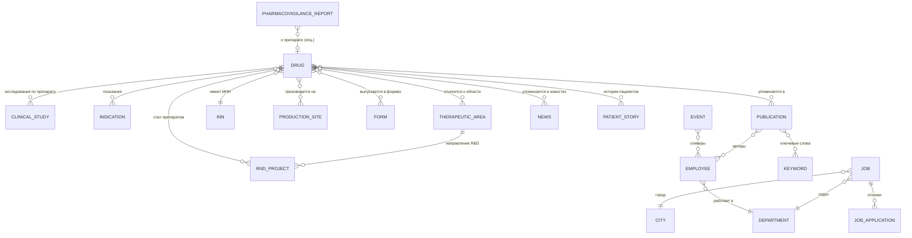

# ER-диаграмма — Герофарм (v0.1)

> **Дата создания:** 2026-04-22
> **Автор:** Потапов (подготовка к проекту)
> **Статус:** черновик для обсуждения, не финальная версия
> **Источники:** КП на разработку (loo.ch ↔ Герофарм), структура Figma-файла (22 раздела на 2026-04-22), общие знания о корпоративных сайтах в фарме

---

## Цель документа

Зафиксировать первичную модель данных для сайта Герофарм **до старта разработки** (1 июня 2026).

Используется как:
- Отправная точка для обсуждения с тех-директором и менеджером проекта
- Чек-лист открытых вопросов к заказчику и дизайнерам
- База для первичной настройки инфоблоков и планирования миграций

**Живой документ** — обновлять по мере появления макетов и ответов от команды.

---

## Четыре типа сущностей в Битриксе

В Битриксе не «таблицы БД», а более высокоуровневые абстракции. От выбранной абстракции зависит поведение в админке и API.

| Тип | Когда использовать | Примеры для Герофарма |
|---|---|---|
| **Инфоблок** | Есть детальная страница, редактор часто правит, нужны кастомные свойства, нужна индексация поиска | Препарат, Новость, Вакансия, Публикация |
| **HL-блок** (Highload) | Справочник / фильтр, короткая запись без детальной страницы, много записей | Город, МНН, Форма выпуска |
| **Форма** (модуль `form` или своя таблица) | Приходит от пользователя, в админке смотрится как список заявок, не индексируется | Фармаконадзор, Отклик на вакансию, Контакты |
| **Пользовательское свойство** (enum) | 2–10 значений, редко меняется, простой выпадающий список | Статус исследования, Тип контрагента |

---

## Часть A — Инфоблоки

### A.1 Препарат (`drugs`) 🌟 центральная сущность

| Код | Тип | Примечание |
|---|---|---|
| `NAME` | строка | торговое название |
| `CODE` | строка | слаг (`semavic`, `sedzharo`) |
| `DETAIL_PICTURE` | картинка | изображение упаковки / генеративная графика |
| `PREVIEW_TEXT` | текст | короткое описание для карточки в каталоге |
| `DETAIL_TEXT` | HTML | полное описание (но основная инструкция — в `INSTRUCTION_PDF`) |
| `MNN` | привязка к HL «МНН» | международное непатентованное наименование |
| `FORM` | привязка к HL «Форма выпуска» (множ.) | таблетки / раствор / шприц-ручка и т.п. |
| `INDICATIONS` | привязка к инфоблоку «Показания» (множ.) | см. вопрос B в «Открытых вопросах» |
| `THERAPEUTIC_AREAS` | привязка к инфоблоку «Терапевтическое направление» (множ.) | |
| `PRODUCTION_SITES` | привязка к инфоблоку «Производственная площадка» (множ.) | |
| `IS_FLAGSHIP` | флаг (bool) | `true` для Семовика/Седжаро — отдельный шаблон страницы |
| `INSTRUCTION_PDF` | файл | официальная инструкция |
| `SHELF_LIFE` | строка | срок годности |
| `HCP_MATERIALS` | файл (множ.) | материалы для врачей (за HCP-гейтом) |
| `EXTERNAL_ID` | строка | для синка со старым сайтом / 1С-номенклатурой (если будет) |

### A.2 Терапевтическое направление (`therapeutic_areas`)
- `NAME`, `CODE`
- `ICON` (SVG для плитки)
- `PREVIEW_PICTURE`
- `DETAIL_TEXT` (обзор заболевания, методы лечения)

### A.3 Клиническое исследование (`clinical_studies`)
- `NAME`, `CODE`
- `STATUS` (enum: планируется / активное / завершено / приостановлено)
- `PHASE` (enum: I / II / III / IV)
- `START_DATE`, `END_DATE`
- `DRUGS` (привязка к препаратам, множ.)
- `THERAPEUTIC_AREA` (привязка, опц.)
- `RESULTS_LINK` (URL или файл с публикацией результатов)
- `DESCRIPTION`

### A.4 Научная публикация (`publications`)
- `NAME` (заголовок)
- `AUTHORS` (привязка к «Сотруднику», множ.)
- `JOURNAL` (строка) — название журнала
- `YEAR` (int)
- `ABSTRACT` (текст)
- `PDF` (файл)
- `DOI` (строка)
- `KEYWORDS` (привязка к HL «Ключевые слова», множ.)
- `LANGUAGE` (enum: ru / en)
- `RELATED_DRUGS` (привязка к препаратам, множ.) — опц.
- `CITATIONS_COUNT` (int) — если важно

### A.5 Научное мероприятие (`events`)
- `NAME`, `DATE`, `LOCATION`
- `DESCRIPTION`, `PROGRAM` (HTML)
- `SPEAKERS` (привязка к «Сотруднику», множ.)
- `PRESENTATIONS` (файл, множ.)
- `PHOTOS` (картинка, множ.)
- `STATUS` (enum: предстоящее / прошедшее)
- `THERAPEUTIC_AREA` (привязка, опц.)

### A.6 R&D-проект / Pipeline-этап (`pipeline`)
- `NAME` (название молекулы / проекта)
- `THERAPEUTIC_AREA` (привязка)
- `PHASE` (enum: discovery / preclinical / phase_1 / phase_2 / phase_3 / registered)
- `START_DATE`, `EXPECTED_DATE`
- `DESCRIPTION`
- `PATENTS` (строка или файл)
- `RESULTING_DRUG` (привязка к «Препарат», опц.) — если молекула стала препаратом

### A.7 Новость (`news`)
- `NAME`, `CODE`, `ACTIVE_FROM`
- `PREVIEW_PICTURE`, `PREVIEW_TEXT`, `DETAIL_TEXT`
- `TAGS` (привязка к HL «Тег новости», множ.)
- `RELATED_DRUGS` / `RELATED_EVENTS` (опц.)

### A.8 Вакансия (`jobs`)
- `NAME`
- `CITY` (привязка к HL «Город»)
- `DEPARTMENT` (привязка к HL «Отдел»)
- `DESCRIPTION`, `REQUIREMENTS`
- `EMPLOYMENT_TYPE` (enum: постоянная / стажировка / проект)
- `IS_YOUNG_SPECIALIST` (флаг) — для раздела «Молодым специалистам»
- `IS_MED_REP` (флаг) — для раздела «Я медпредставитель»
- `PUBLISHED_AT`, `CLOSED_AT`

### A.9 Производственная площадка (`production_sites`)
- `NAME` (Оболенск / Пушкин)
- `DESCRIPTION`, `CAPACITY`
- `PHOTOS`, `VIDEO`
- `SPECIALIZATION` (строка)
- `STAFF_INTERVIEWS` (HTML или привязка к «Сотруднику»)

### A.10 Сотрудник (`employees`)

> ⚠️ Универсальная сущность. Одна запись может быть одновременно автором публикации, спикером мероприятия, лицом в блоке «отзывы сотрудников».

- `NAME`, `POSITION`
- `DEPARTMENT` (привязка к HL «Отдел»)
- `PHOTO`, `BIO`
- `ROLE_TAGS` (enum множ.: автор / спикер / лицо бренда / интервью)

**Решение для обсуждения:** делать одним инфоблоком (как сейчас) или разбить на «Автор», «Спикер» и т.п.? Плюс единого — нет дубликатов. Минус — разнородные свойства.

### A.11 Социальный проект (`social_projects`)
- `NAME`, `DESCRIPTION`
- `RESULTS` (HTML / инфографика)
- `PHOTOS`
- `TESTIMONIALS` (HTML)
- `REGION` (строка, опц.)

### A.12 История пациента / Отзыв (`patient_stories`)
- `NAME` (имя или псевдоним)
- `STORY` (текст)
- `PHOTO`
- `TREATMENT_CONTEXT` (строка: «живёт с диабетом 10 лет» и т.п.)
- `RELATED_DRUG` (привязка, опц.)

### A.13 ESG-отчёт (`esg_reports`)
- `NAME` («Отчёт 2025»), `YEAR`
- `FILE` (PDF)
- `KPI_DATA` (HTML или JSON-поле для структурированных данных)

---

## Часть B — HL-блоки (справочники)

| Справочник | Поля | Используется в | Примечание |
|---|---|---|---|
| **МНН** | `UF_NAME`, `UF_DESCRIPTION` | Препарат (фильтр каталога) | |
| **Форма выпуска** | `UF_NAME` | Препарат | |
| **Показание** | `UF_NAME`, `UF_DESCRIPTION` | Препарат (фильтр) | Возможно инфоблок — см. вопрос B |
| **Город** | `UF_NAME` | Вакансия | |
| **Отдел/направление** | `UF_NAME` | Вакансия, Сотрудник | |
| **Ключевое слово публикации** | `UF_NAME` | Публикация (для поиска) | |
| **Тег новости** | `UF_NAME` | Новость | |
| **Страна (для экспорта/СНГ)** | `UF_NAME`, `UF_ISO_CODE`, `UF_FLAG` | Экспорт | |

---

## Часть C — Формы (пользовательские заявки)

### C.1 Фармаконадзор (`pharmacovigilance_reports`) ⚠️ регуляторно
- `REPORTER_TYPE` (enum: пациент / врач / другое)
- `REPORTER_NAME`, `REPORTER_CONTACT`, `REPORTER_QUALIFICATION`
- `PATIENT_DATA` (возраст, пол, вес)
- `DRUG_NAME` (привязка к препарату + строка «другое»)
- `DRUG_BATCH` (серия)
- `ADVERSE_EVENT_DESCRIPTION`
- `EVENT_SEVERITY` (enum)
- `EVENT_OUTCOME` (enum)
- `ATTACHMENTS` (файлы, множ.)
- `CONSENT_PDN` (флаг согласия на обработку ПДн, обязательный)
- `SUBMITTED_AT`, `PROCESSED_AT`, `ASSIGNED_TO`

**Особые требования** (см. Открытые вопросы → пункт A):
- Уведомления ответственному отделу (email / push в Битрикс24 / CRM?)
- Хранение согласно 152-ФЗ
- Форма регулируется Росздравнадзором — уточнить актуальные требования

### C.2 Отклик на вакансию (`job_applications`)
- `JOB_ID` (связь с Вакансия)
- `NAME`, `EMAIL`, `PHONE`
- `RESUME` (файл)
- `COVER_LETTER` (текст)
- `CONSENT_PDN`
- `SUBMITTED_AT`

### C.3 Контактная форма (`contact_requests`)
- `TOPIC` (enum: закупки / кадры / пресса / общий)
- `NAME`, `EMAIL`, `MESSAGE`
- `CONSENT_PDN`
- `SUBMITTED_AT`

### C.4 Подписка на новости (`subscriptions`)
- `EMAIL`, `CATEGORIES` (множ.), `CONFIRMED`
- `CREATED_AT`, `CONFIRMED_AT`, `UNSUBSCRIBED_AT`

---

## Часть D — Диаграмма связей

Читать:
- `||--o{` — **1:N** (один ко многим)
- `}o--o{` — **N:M** (многие ко многим)
- `}o--||` — **N:1** (многие к одному)
- `}o--o|` — **N:0..1** (опциональная связь)

Рендерится автоматически в GitHub/GitLab/Notion/VS Code (с расширением Mermaid).

---

## Часть E — Открытые вопросы

Отсортировано по влиянию на архитектуру — сверху то, что нужно решить первым.

### A. Мультиязычность — multisite или lang-файлы?
Если multisite (разные сайты в админке) — все инфоблоки **дублируются** по языку. Если lang-файлы + одно дерево — локализуется только интерфейс, контент в одном. Решение **до старта разработки**, переделка позже — недели работы.
- [ ] Обсудить с тех-директором
- [ ] Узнать у заказчика: сколько языков в MVP, сколько регионов планируется

### B. «Показание» — инфоблок или HL-блок?
- Инфоблок: если есть отдельная страница «Сахарный диабет: препараты, лечение, исследования»
- HL-блок: если это только значение в фильтре каталога
- [ ] Посмотреть в Figma раздел «Терапевтическое направление» / «Показания»

### C. Сотрудник — один инфоблок или разделение?
Автор, спикер, лицо для интервью — один человек может играть все три роли.
- [ ] Обсудить с дизайнерами — есть ли разная визуальная подача этих ролей?

### D. R&D проект → Препарат
Когда молекула прошла все фазы и зарегистрирована — новая запись или ссылка на существующую?
- [ ] Обсудить с заказчиком: как они видят жизненный цикл проекта

### E. HCP-гейт (подтверждение «я — врач»)
- Простой чек-бокс «подтверждаю»?
- Форма с указанием клиники/специальности?
- Интеграция с внешним сервисом верификации?
- [ ] Уточнить у заказчика

### F. Фильтры каталога препаратов
По каким свойствам можно фильтровать? От этого зависит выбор компонента: штатный `catalog.smart.filter` или кастом.
- [ ] Дождаться макета «Препараты: умный каталог» в Figma

### G. Pipeline-диаграмма Ганта
- Интерактивная (JS-библиотека типа Frappe Gantt)?
- Статичная инфографика?
- [ ] Уточнить в дизайн-макетах и по объёму данных

### H. Интеграция «наличие в аптеках»
- Чей API? (аптечной сети, агрегатора типа apteka.ru?)
- Документация, ключи доступа, sandbox?
- [ ] Запросить у заказчика **срочно** — может оказаться чёрной дырой

### I. Галерея, Пресс-кит
Отдельные инфоблоки (с альбомами) или просто папки в модуле «Документы»?
- [ ] Обсудить с дизайнерами по макетам

### J. Миграция со старого сайта
- Какая CMS текущего сайта?
- Объём контента (препараты / новости / вакансии)?
- URL-структура для 301-редиректов?
- [ ] Запросить доступ к текущему сайту и обсудить с SEO-подрядчиком

---

## История изменений

| Дата | Версия | Изменения |
|---|---|---|
| 2026-04-22 | v0.1 | Первичный черновик на основе КП и Figma-структуры (22 раздела) |
